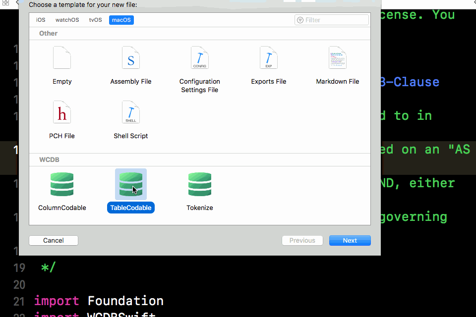

# WCDB.Swfit基础使用

## 1.1 WCDB.Swfit 简介

+ 模型绑定
+ 创建数据库与表
+ 操作数据


### 1.1.1 模型绑定

- `WCDB` 基于 `Swift 4.0` 的 `Codable` 协议实现模型绑定的过程。
- 对于已经存在的 Sample 类：

```swift
class Sample {
    var identifier: Int? = nil
    var description: String? = nil
}
```

- 可通过以下代码将 `Sample` 类的 `identifier` 和 `description` 两个变量绑定到了表中同名字段：

```swift
class Sample: TableCodable {
    var identifier: Int? = nil
    var description: String? = nil
    
    enum CodingKeys: String, CodingTableKey {
        typealias Root = Sample
        static let objectRelationalMapping = TableBinding(CodingKeys.self)
        case identifier
        case description
    }
}
```

- 这部分代码基本都是固定模版。

  

- ### 1.1.2 创建数据库与表

  - `One line of code` 是 `WCDB` 接口设计的一个基本原则，绝大部分的便捷接口都可以通过一行代码完成。
  - 创建数据库对象 WCDB 会在创建数据库文件的同时，创建路径中所有未创建文件夹。

  ```
  let database = Database(withPath: "~/Intermediate/Directories/Will/Be/Created/sample.db")
  复制代码
  ```

  - 创建数据库表 对于已进行模型绑定的类，同样只需一行代码完成。

  ```
  // 以下代码等效于 SQL：CREATE TABLE IF NOT EXISTS sampleTable(identifier INTEGER, description TEXT)
  try database.create(table: "sampleTable", of: Sample.self)
  复制代码
  ```

  

  ### 1.1.3 操作数据

  - 基本的增删查改同样是 One line of code

  

  #### 1.1.3.1 插入操作

  ```
  //Prepare data
  let object = Sample()
  object.identifier = 1
  object.description = "sample_insert"
  //Insert
  try database.insert(objects: object, intoTable: "sampleTable")
  
  复制代码
  ```

  

  #### 1.1.3.2 查找操作

  ```
  let objects: [Sample] = try database.getObjects(fromTable: "sampleTable")
  复制代码
  ```

  

  #### 1.1.3.3 更新操作

  ```
  //Prepare data
  let object = Sample()
  object.description = "sample_update"
  //Update
  try database.update(table: "sampleTable",
                         on: Sample.Properties.description,
                       with: object,
                      where: Sample.Properties.identifier > 0)
                      //类似 Sample.Properties.identifier > 0 的语法是 WCDB 的特性，它能通过 Swift 语法来进行 SQL 操作
  复制代码
  ```

  

  #### 1.1.3.4 删除操作

  ```
  try database.delete(fromTable: "sampleTable")
  复制代码
  ```

  

  ## 1.2. 模型绑定

  ### 1.2.1 Swift 模型绑定

  - **模型绑定**（`Object-relational Mapping`，简称 `ORM`），通过对 `Swift` 类或结构进行绑定，形成类或结构 - 表模型、类或结构对象 - 表的映射关系，从而达到通过对象直接操作数据库的目的。
  - WCDB Swift 的模型绑定分为五个部分：

  > 1. 字段映射
  > 2. 字段约束
  > 3. 索引
  > 4. 表约束
  > 5. 虚拟表映射

  - 这其中大部分是格式化的模版代码，我们在最后介绍文件模版和代码提示模版，以简化模型绑定的操作。

  

  ### 1.2.2 字段映射

  - `WCDB Swift` 的字段映射基于 `Swift 4.0` 的 `Codable` 协议实现。以下是一个字段映射的示例代码：

  ```
  class Sample: TableCodable {
      var identifier: Int? = nil
      var description: String? = nil
      var offset: Int = 0
      var debugDescription: String? = nil
          
      enum CodingKeys: String, CodingTableKey {
          typealias Root = Sample
          static let objectRelationalMapping = TableBinding(CodingKeys.self)
          case identifier = "id"
          case description
          case offset = "db_offset"
      }
  }
  复制代码
  ```

  > 1. 在类内定义 CodingKeys 的枚举类，并遵循 String 和 CodingTableKey。
  > 2. 枚举列举每一个需要定义的字段。
  > 3. 对于变量名与表的字段名不一样的情况，可以使用别名进行映射，如 case identifier = "id"
  > 4. 对于不需要写入数据库的字段，则不需要在 CodingKeys 内定义，如 debugDescription
  > 5. 对于变量名与 SQLite 的保留关键字冲突的字段，同样可以使用别名进行映射，如 offset 是 SQLite 的关键字。

  > 与 Swift 的 Codable 协议不同的是，即便是所有字段都需要绑定，这里也必须列举每一个需要绑定的字段。因为 CodingKeys 除了用于模型绑定，还将用于[语言集成查询](https://github.com/Tencent/wcdb/wiki/Swift-语言集成查询)，我们会在后面章节中介绍。

  - 字段映射定义完成后，调用 `create(table:of:)` 接口即可根据这个定义创建表。

  ```
  // 以下代码等效于 SQL：CREATE TABLE IF NOT EXISTS sampleTable(id INTEGER, description TEXT, db_offset INTEGER)
  try database.create(table: "sampleTable", of: Sample.self)
  复制代码
  ```

  

  #### 1.2.2.1 字段映射的类型

  - 并非所有类型的变量都支持被绑定为字段。WCDB Swift 内建了常用类型的支持，包括：

  | 数据库中的类型 | 类型                                                       |
  | -------------- | ---------------------------------------------------------- |
  |                |                                                            |
  | 32 位整型      | Bool, Int, Int8, Int16, Int32, UInt, UInt8, UInt16, UInt32 |
  | 64 位整型      | Int64, UInt64, Date                                        |
  | 浮点型         | Float, Double                                              |
  | 字符串类型     | String, URL                                                |
  | 二进制类型     | Data, Array, Dictionary, Set                               |

  > 其中 Date 以时间戳的形式存储, Array、Dictionary、Set 以 JSON 的形式存储。

  - 对于没有内建支持的类型，开发者可以手动为其添加支持。我们将在[自定义字段映射类型](https://github.com/Tencent/wcdb/wiki/Swift-自定义字段映射类型)一章进一步介绍。

  ### 1.2.3 字段约束

  - 字段约束是 `TableEncodable` 的一个可选函数，可根据需求选择实现或不实现。它用于定于针对单个字段的约束，如主键约束、非空约束、唯一约束、默认值等。
  - 以下是一个字段约束的示例代码：

  ```
  class Sample: TableCodable {
      var identifier: Int? = nil
      var description: String? = nil
          
      enum CodingKeys: String, CodingTableKey {
          typealias Root = Sample
          static let objectRelationalMapping = TableBinding(CodingKeys.self)
          case identifier
          case description
  
          static var columnConstraintBindings: [CodingKeys: ColumnConstraintBinding]? {
              return [
                  identifier: ColumnConstraintBinding(isPrimary: true),
                  description: ColumnConstraintBinding(isNotNull: true, defaultTo: "defaultDescription"),
              ]
          }
      }
  
      var isAutoIncrement: Bool = false // 用于定义是否使用自增的方式插入
      var lastInsertedRowID: Int64 = 0 // 用于获取自增插入后的主键值
  }
  复制代码
  ```

  - 字段约束通过 `CodingKeys` 到字段约束的字典实现，定义每个 `CodingKeys` 对应的约束。
  - `ColumnConstraintBinding` 初始化函数的声明如下：

  ```
  ColumnConstraintBinding(
      isPrimary: Bool = false, // 该字段是否为主键。字段约束中只能同时存在一个主键
      orderBy term: OrderTerm? = nil, // 当该字段是主键时，存储顺序是升序还是降序
      isAutoIncrement: Bool = false, // 当该字段是主键时，其是否支持自增。只有整型数据可以定义为自增。
      onConflict conflict: Conflict? = nil, // 当该字段是主键时，若产生冲突，应如何处理
      isNotNull: Bool = false, // 该字段是否可以为空
      isUnique: Bool = false, // 该字段是否可以具有唯一性
      defaultTo defaultValue: ColumnDef.DefaultType? = nil // 该字段在数据库内使用什么默认值
  )
  复制代码
  ```

  - 以上约束按需进行定义或者不定义即可。 定义完成后，同样调用 `create(table:of:)` 接口即可根据这个定义创建表。

  ```
  // 以下代码等效于 SQL：CREATE TABLE IF NOT EXISTS sampleTable(identifier INTEGER PRIMARY KEY, description TEXT NOT NULL DEFAULT 'defaultDescription')
  try database.create(table: "sampleTable", of: Sample.self)
  复制代码
  ```

  

  #### 1.2.3.1 自增属性

  - 定义了 `isPrimary`: 的字段，支持以自增的方式进行插入数据。但仍可以通过非自增的方式插入数据。
  - 当需要进行自增插入时，对象需设置 `isAutoIncrement` 参数为 `true`，则数据库会使用 已有数据中最大的值+1 作为主键的值。

  ```
  let autoIncrementObject = Sample()
  autoIncrementObject.isAutoIncrement = true
  
  // 插入自增数据
  try database.insert(objects: autoIncrementObject, intoTable: "sampleTable")
  print(autoIncrementObject.lastInsertedRowID) // 输出 1
  
  // 再次插入自增数据
  try database.insert(objects: autoIncrementObject, intoTable: "sampleTable")
  print(autoIncrementObject.lastInsertedRowID) // 输出 2
  
  // 插入非自增的指定数据
  let specificObject = Sample()
  specificObject.identifier = 10
  try database.insert(objects: specificObject, intoTable: "sampleTable")
  复制代码
  ```

  - 对于自增插入的数据，可以在类内定义 lastInsertedRowID 字段，并以此获取插入的值。

  > 若类只会使用自增的方式插入，而不需要指定值的方式插入，可以在定义时直接设置 `isAutoIncrement` 为 `true`。如：`var isAutoIncrement: Bool { return true }`

  

  ### 1.2.4 索引

  - 索引是 `TableEncodable` 的一个可选函数，可根据需求选择实现或不实现。它用于定于针对单个或多个字段的索引，索引后的数据在能有更高的查询效率。
  - 以下是一个定义索引的示例代码：

  ```
  class Sample: TableCodable {
      var identifier: Int? = nil
      var description: String? = nil
      var multiIndexPart1: Int = 0
      var multiIndexPart2: Int = 0
          
      enum CodingKeys: String, CodingTableKey {
          typealias Root = Sample
          static let objectRelationalMapping = TableBinding(CodingKeys.self)
          case identifier
          case description
          case multiIndexPart1
          case multiIndexPart2
  
          static var indexBindings: [IndexBinding.Subfix: IndexBinding]? {
              return [
                  "_uniqueIndex": IndexBinding(isUnique: true, indexesBy: identifier),
                  "_descendingIndex": IndexBinding(indexesBy: description.asIndex(orderBy: .descending)),
                  "_multiIndex": IndexBinding(indexesBy: multiIndexPart1, multiIndexPart2.asIndex(orderBy: .ascending))
              ]
          }
      }
  }
  复制代码
  ```

  - 索引通过索引后缀与索引绑定的映射实现。

  > 1. 对于需要特别指明索引存储顺序的字段，可以通过 `asIndex(orderBy:)` 函数指定，如 `description.asIndex(orderBy: .descending)。`
  > 2. 对于具有唯一性的索引，可以通过 `isUnique:` 参数指定，如 I`ndexBinding(isUnique: true, indexesBy: identifier)`。
  > 3. 对于由多个字段组成的联合索引，可以通过 `indexesBy:` 进行指定，如 `(indexesBy: multiIndexPart1, multiIndexPart2.asIndex(orderBy: .ascending))`

  - 索引定义完成后，同样调用 `create(table:of:)` 接口即可根据这个定义创建表。

  ```
  // 以下代码等效于 SQL：
  // CREATE TABLE IF NOT EXISTS sampleTable(identifier INTEGER, description TEXT, multiIndexPart1 INTEGER, multiIndexPart2 INTEGER)
  // CREATE UNIQUE INDEX IF NOT EXISTS sampleTable_uniqueIndex on sampleTable(identifier)
  // CREATE INDEX IF NOT EXISTS sampleTable_descendingIndex on sampleTable(description DESC)
  // CREATE INDEX IF NOT EXISTS sampleTable_multiIndex on sampleTable(multiIndexPart1, multiIndexPart2 ASC)
  try database.create(table: "sampleTable", of: Sample.self)
  复制代码
  ```

  

  ### 1.2.5 表约束

  - 表约束是 `TableEncodable` 的一个可选函数，可根据需求选择实现或不实现。它用于定于针对多个字段或表本身的约束。
  - 以下是一个表约束的示例代码：

  ```
  class Sample: TableCodable {
      var identifier: Int? = nil
      var multiPrimaryKeyPart1: Int = 0
      var multiPrimaryKeyPart2: Int = 0
      var multiUniquePart1: Int = 0
      var multiUniquePart2: Int = 0
          
      enum CodingKeys: String, CodingTableKey {
          typealias Root = Sample
          static let objectRelationalMapping = TableBinding(CodingKeys.self)
          case identifier
          case multiPrimaryKeyPart1
          case multiPrimaryKeyPart2
          case multiUniquePart1
          case multiUniquePart2
  
          static var tableConstraintBindings: [TableConstraintBinding.Name: TableConstraintBinding]? {
              let multiPrimaryBinding =
                  MultiPrimaryBinding(indexesBy: multiPrimaryKeyPart1.asIndex(orderBy: .descending), multiPrimaryKeyPart2)
              let multiUniqueBinding =
                  MultiUniqueBinding(indexesBy: multiUniquePart1, multiUniquePart2.asIndex(orderBy: .ascending))
              return [
                  "MultiPrimaryConstraint": multiPrimaryBinding,
                  "MultiUniqueConstraint": multiUniqueBinding
              ]
          }
      }
  }
  复制代码
  ```

  - 表约束通过约束名到表约束的映射实现。包含：

  > 1. MultiPrimaryBinding: 联合主键约束
  > 2. MultiUniqueBinding: 联合唯一约束
  > 3. CheckBinding: 检查约束
  > 4. ForeignKeyBinding: 外键约束

  - 约束的定义方式与索引类似。定义完成后，同样调用 `create(table:of:)` 接口即可根据这个定义创建表。

  ```
  // 以下代码等效于 SQL：
  //  CREATE TABLE IF NOT EXISTS sampleTable(
  //      identifier INTEGER, 
  //      multiPrimaryKeyPart1 INTEGER, 
  //      multiPrimaryKeyPart2 INTEGER, 
  //      multiUniquePart1 INTEGER, 
  //      multiUniquePart1 INTEGER,
  //      CONSTRAINT MultiPrimaryConstraint PRIMARY KEY(multiPrimaryKeyPart1 DESC, multiPrimaryKeyPart2),
  //      CONSTRAINT MultiUniqueConstraint UNIQUE(multiUniquePart1, multiUniquePart2 ASC)
  //  )
  try database.create(table: "sampleTable", of: Sample.self)
  复制代码
  ```

  

  ### 1.2.6 虚拟表映射

  - 虚拟表映射是 `TableEncodable` 的一个可选函数，可根据需求选择实现或不实现。它用于定于虚拟表以进行全文搜索等特性。
  - 普通表不需要用到虚拟表映射，因此这里暂且按下不表，我们会在[全文搜索](https://github.com/Tencent/wcdb/wiki/Swift-全文搜索)一章中进行介绍。

  

  ### 1.2.7 数据库升级

  - 在开发过程中，经过多个版本的迭代后，经常会出现数据库字段升级的情况，如增加新字段、删除或重命名旧字段、新增索引等等。 对于 SQLite 本身，其并不支持对字段的删除和重命名。新增加字段则需要考虑不同版本升级等情况。而这个问题通过模型绑定可以很好的解决。
  - 纵观上述字段映射、字段约束、索引和表约束等四个部分，都是通过调用 create(table:of:) 接口使其生效的。 实际上，该接口会将 模型绑定的定义 与 表本身的结构 联系起来，并进行更新。
  - 对于字段映射：

  > 1. 表已存在但模型绑定中未定义的字段，会被忽略。这可以用于删除字段。
  > 2. 表不存在但模型绑定中有定义的字段，会被新增到表中。这可以用于新增字段。
  > 3. 对于需要重命名的字段，可以通过别名的方式重新映射。

  > 忽略字段并不会删除字段。对于该字段旧内容，会持续存在在表中，因此文件不会因此变小。实际上，数据库作为持续增长的二进制文件，只有将其数据导出生成另一个新的数据库，才有可能回收这个字段占用的空间。对于新插入的数据，该字段内容为空，不会对性能产生可见的影响。

  - 对于索引，不存在的索引会被新增到数据库中。

  > 对于数据库已存在但模型绑定中未定义的索引，`create(table:of:)` 接口不会自动将其删除。如果需要删除，开发者需要调用 `drop(index:)` 接口。

  - 以下是数据库升级的一个例子： 在第一个版本中，Sample 的模型绑定定义如下，并在数据库创建了以之对应的表 sampleTable

  ```
  class Sample: TableCodable {
      var identifier: Int? = nil
      var description: String? = nil
      var createDate: Date? = nil
      
      enum CodingKeys: String, CodingTableKey {
          typealias Root = Sample
          static let objectRelationalMapping = TableBinding(CodingKeys.self)
          case identifier
          case description
          case createDate
      }
  }
  
  try database.create(table: "sampleTable", of: Sample.self)
  复制代码
  ```

  到了第二个版本，sampleTable 表进行了升级。

  ```
  class Sample: TableCodable {
      var identifier: Int? = nil
      var content: String? = nil
      var title: String? = nil
      
      enum CodingKeys: String, CodingTableKey {
          typealias Root = Sample
          static let objectRelationalMapping = TableBinding(CodingKeys.self)
          case identifier
          case content = "description"
          case title
      }
      static var indexBindings: [IndexBinding.Subfix: IndexBinding]? {
          return [
              "_index": IndexBinding(indexesBy: title)
          ]
      }
  }
  
  try database.create(table: "sampleTable", of: Sample.self)
  复制代码
  ```

  - 可以看到，通过修改模型绑定，并再次调用 create(table:of:)

  > 1. description 字段通过别名的特性，被重命名为了 content。
  > 2. 已删除的 createDate 字段会被忽略。
  > 3. 对于新增的 title 会被添加到表中。

  

  ### 1.2.8 文件与代码模版

  - 模型绑定的大部分都是格式固定的代码，因此，WCDB Swift 提供了文件模版和代码模版两种方式，以简化模型绑定操作。 文件和代码模版都在源代码的 tools/templates 目录下

  > 未获取 WCDB 的 Github 仓库的开发者，可以在命令执行 curl [raw.githubusercontent.com/Tencent/wcd…](https://raw.githubusercontent.com/Tencent/wcdb/master/tools/templates/install.sh) -s | sh

  > 已获取 WCDB 的 Github 仓库的开发者，可以手动执行 cd path-to-your-wcdb-dir/tools/templates; sh install.sh; 。

  

  #### 1.2.8.1 文件模版

  文件模版安装完成后，在 Xcode 的菜单 File -> New -> File... 中创建新文件，选择 TableCodable。 在弹出的菜单中输入文件名，并选择 Language 为 Swift 即可。

  

  在代码文件中的任意位置，输入 TableCodableClass 后选择代码模版即可。

  

  文件和代码模版都是以 class 作为例子的，实际上 struct 甚至 enum 都可以进行模型绑定的。

  

  ## 1.3. 增删改查

  - 增删查改是数据库最常用的功能，因此 WCDB Swift 对其进行了特别的封装，使其通过一行代码即可完成操作。

  

  ### 1.3.1 插入操作

  - 插入操作有 "insert" 和 "insertOrReplace" 两个接口。故名思义，前者只是单纯的插入数据，当数据出现冲突时会失败，而后者在主键一致时，新数据会覆盖旧数据。
  - 以已经完成模型绑定的类 Sample 为例：

  ```
  class Sample: TableCodable {
      var identifier: Int? = nil
      var description: String? = nil
      
      enum CodingKeys: String, CodingTableKey {
          typealias Root = Sample
          static let objectRelationalMapping = TableBinding(CodingKeys.self)
          case identifier
          case description
  
          static var columnConstraintBindings: [CodingKeys: ColumnConstraintBinding]? {
              return [
                  identifier: ColumnConstraintBinding(isPrimary: true),
              ]
          }
      }
  }
  
  try database.create(table: "sampleTable", of: Sample.self)
  
  let object = Sample()
  sample.identifier = 1
  sample.description = "insert"
  try database.insert(objects: object, intoTable: "sampleTable") // 插入成功
  
  try database.insert(objects: object, intoTable: "sampleTable") // 插入失败，因为主键 identifier = 1 已经存在
  
  sample.description = "insertOrReplace"
  try database.insertOrReplace(objects: object, intoTable: "sampleTable") // 插入成功
  复制代码
  ```

  - "insert" 函数的原型为：

  ```
  // insert 和 insertOrReplace 函数只有函数名不同，其他参数都一样。
  func insert<Object: TableEncodable>(
      objects: [Object], // 需要插入的对象。WCDB Swift 同时实现了可变参数的版本，因此可以传入一个数组，也可以传入一个或多个对象。
      on propertyConvertibleList: [PropertyConvertible]? = nil, // 需要插入的字段
      intoTable table: String // 表名
  ) throws
  复制代码
  ```

  这里需要特别注意的是 `propertyConvertibleList` 参数，它是 遵循 `PropertyConveritble` 协议的对象的数组。我们会在[语言集成查询](https://github.com/Tencent/wcdb/wiki/Swift-语言集成查询)进一步介绍。这里只需了解，它可以传入模型绑定中定义的字段，如 `Sample.Properties.identifier`。

  当不传入 `propertyConvertibleList` 参数时，"`insert`" 或 "`insertOrReplace`" 接口会使用所有定义的字段进行插入。而 `propertyConvertibleList` 不为空时，"`insert`" 或 "`insertOrReplace`" 只会插入指定的字段，这就构成了部分插入。

  - 以下是一个部分插入的例子：

  ```
  let object = Sample()
  sample.identifier = 1
  sample.description = "insert"
  try database.insert(objects: object, on: Sample.Properties.identifier, intoTable: "sampleTable") // 部分插入，没有指定 description。
  复制代码
  ```

  这个例子中，指定了只插入 `identifier` 字段，因此其他没有指定的字段，会使用 模型绑定中定义的默认值 或 空 来代替。这里 `description` 没有定义默认值，因此其数据为空。

  > 插入是最常用且比较容易操作卡顿的操作，因此 WCDB Swift 对其进行了特殊处理。 当插入的对象数大于 1 时，WCDB Swift 会自动开启事务，进行批量化地插入，以获得更新的性能。

  

  ### 1.3.2 删除操作

  - 删除操作只有一个接口，其函数原型为：

  ```
  func delete(fromTable table: String, // 表名
              where condition: Condition? = nil, // 符合删除的条件
              orderBy orderList: [OrderBy]? = nil, // 排序的方式
              limit: Limit? = nil, // 删除的个数
              offset: Offset? = nil // 从第几个开始删除
  ) throws
  复制代码
  ```

  删除接口会删除表内的数据，并通过 `condition`、`orderList`、`limit` 和 `offset` 参数来确定需要删除的数据的范围。

  这四个组合起来可以理解为：将 `table` 表内，满足 `condition` 的数据，按照 `orderList` 的方式进行排序，然后从头开始第 `offset` 行数据后的 `limit` 行数据删除。

  - 以下是删除接口的示例代码：

  ```
  // 删除 sampleTable 中所有 identifier 大于 1 的行的数据
  try database.delete(fromTable: "sampleTable", 
                      where: Sample.Properties.identifier > 1)
  
  // 删除 sampleTable 中 identifier 降序排列后的前 2 行数据
  try database.delete(fromTable: "sampleTable", 
                      orderBy: Sample.Properties.identifier.asOrder(by: .descending), 
                      limit: 2)
  
  // 删除 sampleTable 中 description 非空的数据，按 identifier 降序排列后的前 3 行的后 2 行数据
  try database.delete(fromTable: "sampleTable", 
                      where: Sample.Properties.description.isNotNull(), 
                      orderBy: Sample.Properties.identifier.asOrder(by: .descending), 
                      limit: 2,
                      offset: 3)
  
  // 删除 sampleTable 中的所有数据
  try database.delete(fromTable: "sampleTable")
  复制代码
  ```

  - 这里的 `condition`、`limit` 和 `offset` 本质都是遵循 `ExpressionConvertible` 的对象，可以是数字、字符串、字段或其他更多的组合。同样地，我们会在[语言集成查询](https://github.com/Tencent/wcdb/wiki/Swift-语言集成查询)进一步介绍。
  - 删除接口不会删除表本身，开发者需要调用 `drop(table:)` 接口删除表。

  

  ### 1.3.3 更新操作

  - 更新操作有 "update with object" 和 "update with row" 两个接口。它们的原型分别

  ```
  func update<Object: TableEncodable>(
      table: String,
      on propertyConvertibleList: [PropertyConvertible],
      with object: Object,
      where condition: Condition? = nil,
      orderBy orderList: [OrderBy]? = nil,
      limit: Limit? = nil,
      offset: Offset? = nil) throws
  
  func update(
      table: String,
      on propertyConvertibleList: [PropertyConvertible],
      with row: [ColumnEncodableBase],
      where condition: Condition? = nil,
      orderBy orderList: [OrderBy]? = nil,
      limit: Limit? = nil,
      offset: Offset? = nil) throws
  复制代码
  ```

  - 其中 `propertyConvertibleList`、`condition`、`limit` 和 `offset` 都在前文介绍过了，这里不再赘述。 两个接口除了 with 之后的参数，其他都一致。
  - "with object" 故名思义，通过 object 对象进行更新。以下是更新操作的示例代码：

  ```
  let object = Sample()
  object.description = "update"
  
  // 将 sampleTable 中所有 identifier 大于 1 且 description 字段不为空 的行的 description 字段更新为 "update"
  try database.update(table: "sampleTable"
                      on: Sample.Properties.description,
                      with: object,
                      where: Sample.Properites.identifier > 1 && Sample.Properties.description.isNotNull())
  
  // 将 sampleTable 中前三行的 description 字段更新为 "update"
  try database.update(table: "sampleTable"
                      on: Sample.Properties.description,
                      with: object,
                      limit: 3)
  复制代码
  ```

  - 而 "with row" 接口则是通过 row 来对数据进行更新。row 是遵循 ColumnEncodable 协议的类型的数组。ColumnEncodable 协议会在后续自定义字段映射类型中进一步介绍。这里只需了解，能够进行字段映射的类型基本都遵循 ColumnEncodable 协议。
  - 因此，与 "with object" 对应的示例代码为：

  ```
  let row: [ColumnCodableBase] = ["update"]
  
  // 将 sampleTable 中所有 identifier 大于 1 且 description 字段不为空 的行的 description 字段更新为 "update"
  try database.update(table: "sampleTable"
                      on: Sample.Properties.description,
                      with: row,
                      where: Sample.Properites.identifier > 1 && Sample.Properties.description.isNotNull())
  
  // 将 sampleTable 中前三行的 description 字段更新为 "update"
  try database.update(table: "sampleTable"
                      on: Sample.Properties.description,
                      with: row,
                      limit: 3)
  复制代码
  ```

  

  ### 1.3.4 查找操作

  - 查找接口对应的操作有 8 个，分别为

  > 1. getObjects
  > 2. getObject
  > 3. getRows
  > 4. getRow
  > 5. getColumn
  > 6. getDistinctColumn
  > 7. getValue
  > 8. getDistinctValue

  虽然接口较多，但大部分都是为了简化操作而提供的便捷接口。实现上其实与 update 类似，只有 "object" 和 "row" 两种方式。

  

  #### 1.3.4.1 对象查找操作

  - "`getObjects`" 和 "`getObject`" 都是对象查找的接口，他们直接返回已进行模型绑定的对象。它们的函数原型为：

  ```
  func getObjects<Object: TableDecodable>(
      on propertyConvertibleList: [PropertyConvertible],
      fromTable table: String,
      where condition: Condition? = nil,
      orderBy orderList: [OrderBy]? = nil,
      limit: Limit? = nil,
      offset: Offset? = nil) throws -> [Object]
  
  func getObject<Object: TableDecodable>(
      on propertyConvertibleList: [PropertyConvertible],
      fromTable table: String,
      where condition: Condition? = nil,
      orderBy orderList: [OrderBy]? = nil,
      offset: Offset? = nil) throws -> Object?
  复制代码
  ```

  - 其中 `propertyConvertibleList`、`condition`、`limit` 和 `offset` 都在前文介绍过了，这里不再赘述。 而 "`getObject`" 等价于 limit: 1 时的 "getObjects" 接口。不同的是，它直接返回 `Object` 对象，而不是一个数组，使用上更便捷。 以下是对象查找操作的示例代码：

  ```
  // 返回 sampleTable 中的所有数据
  let allObjects: [Sample] = try database.getObjects(fromTable: "sampleTable")
  
  // 返回 sampleTable 中 identifier 小于 5 或 大于 10 的行的数据
  let objects: [Sample] = try database.getObjects(fromTable: "sampleTable", 
                                                  where: Sample.Properties.identifier < 5 || Sample.Properties.identifier > 10)
  
  // 返回 sampleTable 中 identifier 最大的行的数据
  let object: Sample? = try database.getObject(fromTable: "sampleTable", 
                                               orderBy: Sample.Properties.identifier.asOrder(by: .descending))
  复制代码
  ```

  > 由于对象查找操作使用了范型，因此需要显式声明返回值的类型以匹配范型。否则会报错 `let allObjects = try database.getObjects(fromTable: "sampleTable")` // 没有显式声明 `allObjects` 类型，范型无法匹配，无法编译通过。

  

  #### 1.3.4.2 对象部分查询

  - 与 "insert"、"update" 类似，对象查找操作也支持指定字段，例如：

  ```
  let objects: [Sample] = try database.getObjects(fromTable: "sampleTable", 
                                                  on: Sample.Properties.identifier)
  
  复制代码
  ```

  - 这里只获取了 `identifier` 字段，而没有获取 `description` 的值。这就可能与 `Swift` 本身存在冲突。 Swift 规定了对象创建时，必须初始化所有成员变量。而进行对象部分查询时，则可能出现某部分变量没有变查询，因此无法初始化的情况。因此，对于可能不被查询的成员变量，应将其类型定义为可选值。 对于 Sample 类中，上述 "`getObjects`" 接口虽然没有获取 `description` 的值，但由于 `description` 是 `String`? 类型，因此不会出错。 而以下则是会出错的例子：

  ```
  class PartialSample: TableCodable {
      var identifier: Int? = nil
      var description: String = ""
      
      enum CodingKeys: String, CodingTableKey {
          typealias Root = PartialSample
          static let objectRelationalMapping = TableBinding(CodingKeys.self)
          case identifier
          case description
      }
  }
  
  // 由于 description 是 String 类型，"getObject" 过程无法对其进行初始化，因此以下调用会出错。
  // 正确的方式应将 `var description: String` 改为 `var description: String?`
  let partialObjects: [PartialSample] = try database.getObjects(fromTable: "sampleTable", on: Sample.Properties.identifier)
  复制代码
  ```

  - 倘若开发者不确定哪些字段可能会被进行对象部分查询，可以将所有字段都定义为可选。

  

  #### 1.3.4.3 值查询操作

  - 其余的 6 个查询接口都是值查询操作，它们都属于 "getRows" 接口的简化接口。其接口声明如下：

  ```
  func getRows(on columnResultConvertibleList: [ColumnResultConvertible],
               fromTable table: String,
               where condition: Condition? = nil,
               orderBy orderList: [OrderBy]? = nil,
               limit: Limit? = nil,
               offset: Offset? = nil) throws -> FundamentalRowXColumn
  复制代码
  ```

  - 其中 condition、orderList、limit 和 offset，前文已经介绍，这里不再赘述。 columnResultConvertibleList 是遵循 ColumnResultConvertible 协议的对象数组，我们会在语言集成查询进一步介绍。
  - 这里只需了解 Sample.Properties.identifier.max() 是遵循 ColumnResultConvertible 协议的对象，用于查找 identifier 列的最大值。
  - 试考虑，表中的数据可以想象为一个矩阵的存在，假设其数据如下：

  | identifier | description |
  | ---------- | ----------- |
  | 1          | "sample1"   |
  | 2          | "sample1"   |
  | 3          | "sample2"   |
  | 4          | "sample2"   |
  | 5          | "sample2"   |

  - 在不考虑 condition、orderList、limit 和 offset 参数的情况下：

  > 1. "getRows" 接口获取整个矩阵的所有内容，即返回值为二维数组。
  > 2. "getRow" 接口获取某一横行的数据，即返回值为一维数组。
  > 3. "getColumn" 接口获取某一纵列的数据，即返回值为一维数组。
  > 4. "getDistinctColumn" 与 "getColumn" 类似，但它会过滤掉重复的值。
  > 5. "getValue" 接口获取矩阵中某一个格的内容。
  > 6. "getDistinctValue" 与 "getValue" 类似，但它会过滤掉重复的值。

  - 以下是值查询操作的示例代码：

  ```
  // 获取所有内容
  let allRows = try database.getRows(fromTable: "sampleTable")
  print(allRows[row: 2, column: 0].int32Value) // 输出 3
  
  // 获取第二行
  let secondRow = try database.getRow(fromTable: "sampleTable", offset: 1)
  print(secondRow[0].int32Value) // 输出 2
  
  // 获取 description 列
  let descriptionColumn = try database.getColumn(on: Sample.Properties.description, fromTable: "sampleTable")
  print(descriptionColumn) // 输出 "sample1", "sample1", "sample1", "sample2", "sample2" 
  
  // 获取不重复的 description 列的值
  let distinctDescriptionColumn = try database.getDistinctColumn(on: Sample.Properties.description, fromTable: "sampleTable")
  print(distinctDescriptionColumn) // 输出 "sample1", "sample2"
  
  // 获取第二行 description 列的值
  let value = try database.getValue(on: Sample.Properties.description, offset: 1)
  print(value.stringValue) // 输出 "sample1"
  
  // 获取 identifier 的最大值
  let maxIdentifier = try database.getValue(on: Sample.Properties.identifier.max(), fromTable: "sampleTable")
  
  // 获取不重复的 description 的值
  let distinctDescription = try database.getDistinctValue(on: Sample.Properties.description, fromTable: "sampleTable")
  print(distinctDescription.stringValue) // 输出 "sample1"
  复制代码
  ```

  

  ## 1.4. 数据库，表，事务

  - WCDB Swift 的三个基础类：数据库 - Database、表 - Table 和 事务 - Transaction。它们同时拥有以下特性：

  > 1. 支持增删查改的便捷接口
  > 2. 支持链式接口
  > 3. 数据和状态共享
  > 4. 线程安全

  - **数据和状态共享**，意味着对于 同一个路径的数据库 的 不同基础类，它们的标签、数据库是否打开、是否在进行读写操作等所有状态和数据都始终保持一致。

  ```
  let myTag = 1
  let database = Database(withPath: filePath)
  database.tag = myTag
  print(database.tag) // 输出 1
  
  let databaseAlias = Database(withPath: filePath)
  print(databaseAlias.tag) // 输出 1
  
  let table = try database.getTable(named: "sampleTable", of: Sample.self)
  print(table.tag) // 输出 1
  
  let transaction = try database.getTransaction()
  print(transaction.tag) // 输出 1
  
  database.tag = 2
  print(database.tag) // 输出 2
  print(databaseAlias.tag) // 输出 2
  print(table.tag) // 输出 2
  print(transaction.tag) // 输出 2
  复制代码
  ```

  > 基础类共享数据和状态的本质是，它们共享同一个 Core，而所有操作都在这个 Core 上发生。

  - **线程安全**，意味着开发者可以在 任意线程 对 任意基础类 调用 任意接口，而不需要考虑数据库本身的线程安全问题。同时，WCDB Swift 会根据调用情况，并发执行操作，以达到更高的性能。

  > WCDB Swift 支持 多线程读操作 或 单线程写多线程读 并发执行。

  ### 1.4.1  数据库

  - Database 是 WCDB Swift 中最基础的类，几乎所有操作都由该类发起。

  

  #### 1.4.1.1  初始化

  - Database 可以通过文件路径或文件 URL 创建一个数据库。

  ```
  let filePath = "~/Intermediate/Directories/Will/Be/Created/sample.db"
  let databaseWithPath = Database(withPath: filePath)
  
  let fileURL = URL(fileURLWithPath: filePath)
  let databaseWithFileURL = Database(withFileURL: fileURL)
  复制代码
  ```

  - 对于已经存在的数据库，也可以通过 tag 来获取。

  ```
  let myTag = 1
  databaseWithPath.tag = myTag
  
  // 若该 tag 不存在，则初始化会失败
  let databaseWithTag = try Database(withExistingTag: myTag)
  复制代码
  ```

  

  #### 1.4.1.2  标签

  - 通过设置标签，可以区分不同的数据库。

  ```
  let myTag1 = 1
  let database1 = Database(withPath: path1)
  database1.tag = myTag1
  
  let myTag2 = 2
  let database2 = Database(withPath: path2)
  database2.tag = myTag2
  复制代码
  ```

  - 同时，基于基础类数据共享的机制，对于同一路径的基础类，它们会共享同一个 tag。

  ```
  print(database1.tag) // 输出 1
  
  let anotherDatabase1 = Database(withPath: path1)
  print(anotherDatabase1.tag) // 输出 1
  复制代码
  ```

  

  #### 1.4.1.3 打开数据库

  - 延迟初始化是 WCDB Swift 的原则之一，绝大部分数据只会在需要用到时才创建并初始化。数据库的打开就是其中一个例子。
  - **数据库会在第一次进行操作时，自动打开并初始化。开发者不需要手动调用。**

  ```
  let database = Database(withPath: filePath)
  print(database.isOpened) // 输出 false
  try database.create(table: "sampleTable", of: Sample.self) // 数据库此时会被自动打开
  print(database.isOpened) // 输出 true
  复制代码
  ```

  - 同时，也可以通过 canOpen 接口测试数据库能否正常打开。

  ```
  let database1 = Database(withPath: filePath)
  print(database1.isOpened) // 输出 false
  print(database1.canOpen) // 输出 true。仅当数据库无法打开时，如路径无法创建等，该接口会返回 false
  print(database1.isOpened) // 输出 true
  let database2 = Database(withPath: filePath)
  print(database2.isOpened) // 输出 true。WCDB Swift 同一路径的数据库共享数据和状态等。
  复制代码
  ```

  

  #### 1.4.1.4 关闭数据库

  - 与打开数据库相对应，**关闭数据库一般情况下也不需要开发者手动调用**。当没有指向 Database 所共享的 Core 时，**数据库会自动关闭**，并回收内存。

  ```
  do {
      let database1 = Database(withPath: filePath)
      try database1.create(table: "sampleTable", of: Sample.self) // 数据库此时会被自动打开
      print(database1.isOpened) // 输出 true
  } // 作用域结束，database1 deinit、关闭数据库并回收内存
  let database2 = Database(withPath: filePath)
  print(database2.isOpened) // 输出 false
  复制代码
  let database1 = Database(withPath: filePath)
  {
      let database2 = Database(withPath: filePath)
      try database2.create(table: "sampleTable", of: Sample.self) // 数据库此时会被自动打开
      print(database2.isOpened) // 输出 true
  } // 作用域结束，database2 deinit，但 database1 仍持有该路径的数据库，因此不会被关闭。
  print(database1.isOpened) // 输出 true
  复制代码
  ```

  - 同时，也可以调用 close 接口，手动关闭数据库。

  ```
  let database = Database(withPath: filePath)
  print(database.canOpen) // 输出 true
  print(database.isOpened) // 输出 true
  database.close()
  print(database.isOpened) // 输出 false
  复制代码
  ```

  > WCDB Swift 也提供了 blockade、unblockade 和 isBlockaded 接口用于分步执行关闭数据库操作，可参考[相关接口文档](https://tencent.github.io/wcdb/references/apple_swift/Classes/Database.html#/s:9WCDBSwift8DatabaseC5closeyyyKc8onClosed_tKF)

  

  #### 1.4.1.5 关闭数据库与线程安全

  某些情况下，开发者需要确保数据库完全关闭后才能进行操作，如移动文件操作。

  数据库是二进制文件，移动文件的过程中若数据发生了变化，则移动后的文件数据可能会不完整、损坏。因此，WCDB Swift 提供了 close: 接口。

  ```
  try database.close(onClosed: {
      try database.moveFiles(toDirectory: otherDirectory)
  })
  复制代码
  ```

  在 `onClosed` 参数内，可确保数据库完全关闭，不会有其他线程的数据访问、操作数据库，因此可以安全地操作文件。

  

  #### 1.4.1.6 内存回收

  - `purge` 接口用于回收暂不使用的内存。

  ```
  // 回收 database 数据库中暂不使用的内存
  database.purge() 
  // 回收所有已创建的数据库中暂不使用的内存
  Database.purge() 
  复制代码
  ```

  - 在 iOS 平台上，当内存不足、收到系统警告时，WCDB Swift 会**自动调用** `Database.purge()` 接口以减少内存占用。

  #### 1.4.1.7 文件操作

  ```
  // 获取所有与该数据库相关的文件路径
  print(database.paths) 
  // 获取所有与该数据库相关的文件占用的大小
  try database.close(onClosed: {
      // 数据库未关闭状态下也可获取文件大小，但不够准确，开发者可自行选择是否关闭
      let filesSize = try database.getFilesSize()
      print(filesSize)
  })
  // 删除所有与该数据库相关的文件
  try database.close(onClosed: {
      try database.removeFiles()
  })
  // 将所有与该数据库相关的文件移动到另一个目录
  try database.close(onClosed: {
      try database.moveFiles(toDirectory: otherDirectory)
  })
  复制代码
  ```

  ### 1.4.2  表

  - Table 指代数据库中的一个表。可以通过 getTable 接口获取。

  ```
  let table = try database.getTable(named: "sampleTable", of: Sample.self) //  表不存在时会出错
  复制代码
  ```

  - 表相当于指定了表名和模型绑定类的 Database，其实质只是后者的简化版。

  ```
  // 返回值需指定为 [Sample] 类型以匹配范型
  let objectsFromDatabase: [Sample] = try database.getObjects(fromTable: "sampleTable")
  
  // table 已经指定了表名和模型绑定的类，因此可以直接获取
  let objectsFromTable = try table.getObjects()
  复制代码
  ```

  

  ### 1.4.3 事务

  - 事务一般用于 提升性能 和 保证数据原子性。Database 和 Table 都能直接发起事务，也可以通过 Transaction 更好地控制事务。

  ```
  try database.run(transaction: {
      try database.insert(objects: object, intoTable: "sampleTable")
  })
  
  let table = try database.getTable(named: "sampleTable", of: Sample.self)
  table.run(transaction: {
      try database.insert(objects: object)
  })
  
  // 与 Database、Table 类似，开发者可以保存 Transaction 变量
  let transaction = try database.getTransaction()
  transacton.run(transaction: {
      print(transaction.isInTransction) // 输出 true
      try transaction.insert(objects: object)
  })
  复制代码
  ```

  

  #### 1.4.3.1  性能

  - 事务提升性能的实质是批量处理。

  ```
  let object = Sample()
  object.isAutoIncrement = true
  let objects = Array(repeating: object, count: 100000)
  
  // 单独插入，效率很差
  for object in objects {
      try database.insert(objects: object, intoTable: "sampleTable")
  }
  
  // 事务插入，性能较好
  try database.run(transaction: {
      for object in objects {
          try database.insert(objects: object, intoTable: "sampleTable")
      }
  })
  
  // insert(objects:intoTable:) 接口内置了事务，并对批量数据做了针对性的优化，性能更好
  try database.insert(objects: objects, intoTable: "sampleTable")
  复制代码
  ```

  

  #### 1.4.3.2 原子性

  - 试考虑以下代码：

  ```
  DispatchQueue(label: "other thread").async {
      try database.delete(fromTable: "sampleTable")
  }
  
  try database.insert(object: object, intoTable: "sampleTable")
  let objects = try database.getObjects(fromTable: "sampleTable")
  print(objects.count) // 可能输出 0 或 1
  复制代码
  ```

  - 在多线程下，删除操作发生的时机是不确定的。倘若它发生在 插入完成之后 和 取出数据之前 的瞬间，则 `getObjects(fromTable:)` 无法取出刚才插入的数据，且这种多线程低概率的 bug 是很难查的。
  - 而事务可以保证一段操作的原子性：

  ```
  DispatchQueue(label: "other thread").async {
      try database.delete(fromTable: "sampleTable")
  }
  
  try database.run(transaction: {
      try database.insert(objects: object, intoTable: "sampleTable")
      let objects = try database.getObjects(fromTable: "sampleTable")
      print(objects.count) // 输出 1
  })
  复制代码
  ```

  

  #### 1.4.3.3 执行事务

  - WCDB Swift 提供了三种事务:

  > 1. 普通事务
  > 2. 可控事务
  > 3. 嵌入事务

  1. 普通事务

  ```
  // 普通事务
  try database.run(transaction: {
      try database.insert(objects: object, intoTable: "sampleTable")
  })
  // 可控事务
  try database.run(controllableTransaction: {
      try database.insert(objects: object, intoTable: "sampleTable")
      return true // 返回 true 以提交事务，返回 false 以回滚事务
  })
  复制代码
  ```

  1. 可控事务

  > 可控事务在普通事务的基础上，可以通过返回值控制提交或回滚事务

  ```
  // 普通事务
  try database.run(transaction: {
      try database.run(transaction: { // 出错，事务不能嵌套
          try database.insert(objects: object, intoTable: "sampleTable")
      })
  })
  // 嵌入事务
  try database.run(transaction: {
      try database.run(embeddedTransaction: { // 嵌入事务可以嵌套
          try database.insert(objects: object, intoTable: "sampleTable")
      })
  })
  复制代码
  ```

  1. 嵌入事务

  > 1. 嵌入事务在普通事务的基础上，支持嵌套调用。
  > 2. 当外层不存在事务时，嵌入事务和普通事务没有区别。
  > 3. 当外层存在事务时，嵌入事务会跟随外层事务的行为提交或回滚事务。

  > insert(objects:intoTable:)、insertOrReplace(objects:intoTable:)、create(table:of:) 等 WCDB Swift 自带的接口都使用了嵌入事务 WCDB Swift 也提供了 begin、commit 和 rollback 接口用于分步执行事务，可参考相关接口文档

  

  ## 1.5. 语言集成查询

  - 语言集成查询（WCDB Integrated Language Query，简称 WINQ），是 WCDB 的一项基础特性。它使得开发者能够通过 Swift 的语法特性去完成 SQL 语句。

  ```
  let objects: [Sample] = try database.getObjects(fromTable: "sampleTable", where: Sample.Properties.idetifier > 1)
  复制代码
  ```

  - 其中 `where:` 参数后的 `Sample.Properties.idetifier > 1` 就是语言集成查询的其中一个写法。其虽然是 `identifier` 和数字 1 的比较，但其结果并不为 Bool 值，而是 `Expression`。该 `Expression` 作为 SQL 的 `where` 参数，用于数据库查询。

  

  ### 1.5.1 Column

  - Column 代表数据库内的一个字段，如 Insert 语句中的 column-name，指定了需要插入的数据所属的字段。它可通过字段名创建。

  ```
  let identifierColumn = Column(named: "identifier")
  let statementInsert = StatementInsert().insert(intoTable: "sampleTable", 
                                                 with: identifierColumn)
                                         .values(1)
  print(statementInsert.description) // 输出 "INSERT INTO sampleTable(identifier) VALUES(1)"
  复制代码
  ```

  

  ### 1.5.2 ColumnResult

  - `ColumnResult` 通常代表数据库查询中的结果，如 Select 语句中的 result-column，指定了期望查询的结果。

  ```
  let identifierColumn = Column(named: "identifier")
  let identifierColumnResult = ColumnResult(with: identifierColumn)
  let statementSelect = StatementSelect().select(identifierColumnResult).from("sampleTable")
  print(statementSelect.description) // 输出 "SELECT identifier FROM sampleTable"
  
  复制代码
  ```

  

  ### 1.5.3 Convertible

  - 细心观察语法中的描述可以发现，许多节点的参数可以不止一种。以刚才提到的 ColumnResult 为例。

    

  可以看到，Expression 也可以转换为 ColumnResult。

  我们再回到 `StatementSelect` 语句的 select 函数，倘若它只接受 `ColumnResult` 类作为参数，那么每次调用时，都需要将 `Expression` 转换为 `ColumnResult`。

  ```
  // 以下为示例代码，并非 WCDB Swift 真正的实现
  class StatementSelect {
      func select(_ columnResult: ColumnResult...) -> StatementSelect
      // ...
  }
  
  let identifierColumn = Column(named: "identifier")
  let identifierExpression = Expression(identifierColumn)
  let identifierColumnResult = ColumnResult(with: identifierExpression)
  let statementSelect = StatementSelect().select(identifierColumnResult).from("sampleTable")
  print(statementSelect.description) // 输出 "SELECT identifier FROM sampleTable"
  复制代码
  ```

  可以看到，需要 3 重转换，才能将 Column 转换为我们需要的 ColumnResult。

  为了解决这个问题，WCDB Swift 定义了 Convertible 协议，用于语法中可互相转换的类型。

  ```
  // StatementSelect.swift
  func select(distinct: Bool = false,
              _ columnResultConvertibleList: ColumnResultConvertible...
  ) -> StatementSelect 
  
  复制代码
  ```

  基于 `Convertible` 协议，`select` 接口的参数也为 `ColumnResultConvertible`，即所有可转换为 `ColumnResult` 的类型，都能作为 select 函数的参数。

  在 SQL 语法中，`Expression` 是能转换为 `ColumnResult` 的类型；而 `Column` 是能转换为 `Expression` 的类型，因此其也同时是能转换为 `ColumnResult` 的类型。

  ```
  // WCDB Swift 内部的代码示例
  protocol ExpressionConvertible: ColumnResultConvertible { /* ... */ }
  
  struct Column: ExpressionConvertible { /* ... */ }
  struct Expression: ColumnResultConvertible { /* ... */ }
  复制代码
  ```

  因此，原来的 select 语句可以直接简写为：

  ```
  let identifierColumn = Column(named: "identifier")
  let statementSelect = StatementSelect().select(identifierColumn).from("sampleTable")
  print(statementSelect.description) // 输出 "SELECT identifier FROM sampleTable"
  复制代码
  ```

  WCDB Swift 内的 `Convertible` 接口协议较多，这里不一一赘述。开发者也无需逐一了解，在使用时再查阅接口即可。

  

  ### 1.5.4 手动转换

  - 除了通过接口参数的 `Convertible` 协议转换，也可以手动调用 asXXX 接口转换。如 `ColumnResultConvertible` 的协议为：

  ```
  protocol ColumnResultConvertible {
      func asColumnResult() -> ColumnResult
  } 
  复制代码
  ```

  - 对于符合 ColumnResultConvertible 接口的类，直接调用即可：

  ```
  let identifierColumn = Column(named: "identifier")
  let identifierColumnResult = identifierColumn.asColumnResult()
  复制代码
  ```

  

  ### 1.5.5 CodingKeys 和 Property

  - `CodingKeys` 和 `Property` 严格来说不属于语言集成查询的一部分，它们是语言集成查询和模型绑定结合的产物。
  - 当需要通过对象来操作数据库时，如"`getObject`"或者"`update with object`"等，WCDB Swift 不仅需要知道查找数据的哪个字段（即 Column 所完成的事情），还需要知道这个字段对应模型绑定中的哪个变量。

  ```
  let property = Sample.Properties.identifier.asProperty()
  let objects: [Sample] = try database.getObjects(on: property, fromTable: "sampleTable")
  复制代码
  ```

  - 而 `CodingKeys` 和 `Property` 就是存储了数据库字段和模型绑定字段的映射关系。不同的是，后者可以分离这个映射，具体用法可参考高级用法一章的[查询重定向](https://github.com/Tencent/wcdb/wiki/Swift-高级接口#查询重定向)。
  - 基于模型绑定，开发者可以完全摆脱通过字符串创建 Column，更便捷地操作数据库。

  ```
  let statementSelect = StatementSelect().select(Sample.Properties.identifier).from("sampleTable")
  print(statementSelect.description) // 输出 "SELECT identifier FROM sampleTable"
  复制代码
  ```

  - `Sample.Properties.identifier` 和 `Sample.CodingKeys.identifier` 的写法没有区别。`Properties` 只是 `CodingKeys` 的别名 - t`ypealias Properties = CodingKeys`。这是为了让阅读代码时语义更加清晰。

  

  ### 1.5.6 Expression

  - Expression 可以算是 SQL 里最复杂的一个了。它在许多语句中都出现，比如查询语句的 where、groupBy、having、limit、offset，更新语句的 value、where、limit、offset等等。同时，它的完整定义也很长，甚至还包含了递归。
  - 从单个 Expression 的语法角度来看，它支持从数字、字符串、二进制、字段创建。而 WCDB Swift 将其扩展为支持所有字段映射类型，包括[内建的类型][Swift-Object-Relational-Mapping-Builtin-Column-Codable-Type]和自定义的类型。

  ```
  let expressionInt = Expression(with: 1)
  let expressionDouble = Expression(with: 2.0)
  let expressionString = Expression(with: "3")
  let expressionData = Expression(with: "4".data(using: .ascii)!)
  let expressionColumn = Expression(with: Column(named: "identifier"))
  复制代码
  ```

  > 除此之外，还有一个内建的绑定参数 Expression.bindParameter 也是 Expression 类型。

  - 多个 Expression 之间可以通过函数或运算符的方式进行操作，如：

  ```
  let expression = expressionColumn.between(expressionInt, expressionDouble) 
  print(expression.description) // 输出 "identifier BETWEEN 1 AND 2.0"
  复制代码
  ```

  - Expression 语法所支持的运算符有十多个，WCDB Swift 基本都支持，但在语义上改为更符合 Swift 的习惯。例如:

  > 1. || 运算符在 SQL 语法中用于字符串链接，而在 WCDB Swift 中则是用于"或"的逻辑运算。
  > 2. <> 运算符在 SQL 语法中用于不等比较，而在 WCDB Swift 中则是直接使用较为习惯的 != 运算符。

  ```
  let expression1 = expressionInt + expressionDouble
  print(expression1.description) // 输出 "(1 + 2.0)"
  
  let expression2 = expressionColumn >= expression1
  print(expression2.description) // 输出 "(identifier >= (1 + 2.0))"
  
  // 基础类型 -1 可以直接转换为 Expression
  let expression3 = expressionColumn < -1 || expression2
  print(expression3.description) // 输出 "((identifier < -1) OR (identifier >= (1 + 2.0)))"
  
  let statementSelect = StatementSelect().select(Sample.Properties.identifier)
                                         .from("sampleTable")
                                         .where(expression3)
  print(statementSelect.description) // 输出 "SELECT identifier FROM sampleTable WHERE ((identifier < -1) OR (identifier >= (1 + 2.0)))"
  复制代码
  ```

  

  ### 1.5.7 ExpressionOperable

  - 显然，每个类都要转换成 Expression 来进行这些操作，虽然也可以，但这就太麻烦了。

  ```
  let expression = Sample.Properties.identifier.asExpression() > 1
  print(expression)
  复制代码
  ```

  - 因此，WCDB Swift 定义了 ExpressionOperable 协议。遵循该协议的类都可以与 Expression 的类似，使用函数或运算符进行语言集成查询，包括 Column、Expression、Property 和 CodingKeys 等。也因此，基于模型绑定，开发者可以完全摆脱通过拼装 Expression，更便捷地操作数据库。

  ```
  let statementSelect = StatementSelect().select(Sample.Properties.identifier)
                                         .from("sampleTable")
                                         .where(Sample.Properties.identifier < -1 || Sample.Properties.identifier >= 3.0)
  print(statementSelect.description) // 输出 "SELECT identifier FROM sampleTable WHERE ((identifier < -1) OR (identifier >= 3.0))"
  复制代码
  ```

  

  ### 1.5.8 Statement

  - Statement 在前文已经接触到不少了，如查询 StatementSelect、插入 StatementInsert 等。它是一个最基本的完整可被执行的 SQL 语句。
  - SQLite 共包含 [27 种 Statement](http://www.sqlite.org/syntax/sql-stmt.html)，WCDB Swift 基本都支持。根据语法规则创建的 Statement，可以通过基础类的 exec(:) 函数直接执行，可以通过 prepare(:) 创建 CoreStatement 对象做进一步的操作。我们会在高级接口的核心层接口一节详细介绍。

  

  ### 1.5.9 SQL 到语言集成查询

  - 如前文所说，SQL 的复杂性决定了不可能介绍每一个类型及语句。因此，这里将介绍如何将一个已有的 SQL，转写为语言集成查询。开发者可以以此为例子，触类旁通。
  - 对于已有的 SQL：

  > 1. 在语法中确定其所属的 Statement。
  > 2. 对照对应 Statement 的语法，根据关键字对已有的 SQL 进行断句。
  > 3. 逐个通过语言集成查询的函数调用进行实现。

  - 以如下 SQL 为例：

  ```
  SELECT identifier.min() FROM sampleTable WHERE (identifier > 0 || identifier / 2 == 0 ) && description NOT NULL ORDER BY identifier ASC LIMIT 1, 100
  复制代码
  ```

  

  #### 1.5.9.1  归类

  - 根据 Statement 的列表，显然这个 SQL 属于 StatementSelect。

  ```
  let statementSelect = StatementSelect()
  复制代码
  ```

  

  #### 1.5.9.2  断句

  - 根据 [StatementSelect 的语法规则](https://www.sqlite.org/lang_select.html)，按关键词（即语法中的大写字母）进行断句：

  ```
  SELECT identifier.min() 
  FROM sampleTable 
  WHERE (identifier > 0 || identifier / 2 == 0 ) && description NOT NULL 
  ORDER BY identifier ASC 
  LIMIT 1, 100
  复制代码
  ```

  

  #### 1.5.9.3  调用语言集成查询

  - 根据每个关键词，找到语言集成查询中对应的函数，并完成其参数。 如 SELECT 关键词对应 StatementSelect 的 select(distinct:_:) 函数：

  ```
  // distinct 参数的默认值为 false，也可以忽略不写
  statementSelect.select(distinct: false, Sample.Properties.identifier.min())
  statementSelect.from("sampleTable")
  复制代码
  ```

  - WHERE 的参数虽然较复杂，但也都能找到对应的函数：

  ```
  statementSelect.where((Sample.Properties.identifier > 0 || Sample.Properties.identifier / 2 == 0) && Sample.Properties.description.isNotNull())
  复制代码
  ```

  - 其他语句也同理：

  ```
  statementSelect.order(by: Sample.Properties.identifier.asOrder(by: .ascending))
  statementSelect.limit(from: 1, to: 100)
  复制代码
  ```

  

  # 2.WCDB.Swfit 高级功能

  ## 2.1 加密与配置

  - 配置主要用控制数据库操作的行为。WCDB Swift 对 SQLite 的数据库做了基本的配置，如 journal_mode、fullfsync 等，以满足 WCDB Swift 的需求。同时，开发者也可以根据自己的需求，自定义配置项。

  

  ### 2.1.1 默认配置

  - WCDB Swift 提供的默认配置为：

  > 1. PRAGMA locking_mode="NORMAL"
  > 2. PRAGMA synchronous="NORMAL"
  > 3. PRAGMA journal_mode="WAL"
  > 4. PRAGMA fullfsync=1

  

  ### 2.1.2 加密

  - SQLite 支持的配置列表可参考其[官方文档](https://www.sqlite.org/pragma.html)。
  - 加密功能可通过 setCipher(key:pageSize:) 接口开启，其函数原型为：

  ```
  // 该接口等同于配置 PRAGMA cipher="YourPassword"，PRAGMA cipher_page_size=4096
  func setCipher(key optionalKey: Data?, // 密码
                 pageSize: Int = 4096) // 加密页大小
  复制代码
  ```

  其中，pageSize 是加密的页大小参数，SQLCipher 在 iOS 上默认使用 4096，macOS 上默认使用 1024。而 WCDB Swift 则在所有平台上都适用 4096，以获得更好的性能。开发者一般不需要做特别的修改。

  - 对于在 macOS 上通过其他方式创建的加密数据库，在 WCDB Swift 使用时，可手动设置为 1024 以确保解密成功。更多关于 cipher_page_size 的信息，可以参考其[官方文档](https://www.zetetic.net/sqlcipher/sqlcipher-api/#cipher_page_size)。
  - 开启加密会有部分性能损耗，详情请参考 [Benchmark 与性能一章](https://github.com/Tencent/wcdb/wiki)。

  > 值得注意的是，设置密码是一件很慎重的事情。对于已经创建且存在数据的数据库，无论是原本未加密想要改为加密，还是已经加密想要修改密码，都是成本非常高的操作，因此不要轻易使用。更多相关信息可以参考官方文档

  

  ### 2.1.3 自定义配置

  - 除了上述配置，开发者还可以根据自己的需求，通过 setConfig(named:with:orderBy: 接口设置其他配置。详细的配置列表可以参考 [SQLite 的官方文档](https://www.sqlite.org/pragma.html) 和 [SQLCipher 的官方文档](https://www.zetetic.net/sqlcipher/sqlcipher-api/)。
  - 设置配置的接口函数原型如下：

  ```
  func setConfig(named name: String, // 配置名称，同名的配置会互相覆盖
                 with callback: @escaping Config, // 配置的函数
                 orderBy order: ConfigOrder) // 配置执行的顺序，顺序较小的配置优先执行。WCDB Swift 自带的配置从 0 开始。
  
  复制代码
  ```

  - 以下是设置配置的一个例子：

  ```
  database.setConfig(named: "secure_delete", with: { (handle: Handle) throws in 
      let statementPragmaSecureDelete = StatementPragma().pragma(.secureDelete, to: true)
      try handle.exec()
  }, orderBy: 10)
  复制代码
  ```

  ## 2.2 高级接口

  - 本文将介绍 WCDB Swift 的一些高级接口，包括链式调用与联表查询、查询重定向 和 核心层接口。

  ### 2.2.1 链式调用

  - 在增删查改一章中，已经介绍了通过 `Database`、`Table` 或 `Transaction` 操作数据库的方式。它们是经过封装的便捷接口，其实质都是通过调用链式接口完成的。

  ```
  let select: Select = try database.prepareSelect(of: Sample.self, fromTable: "sampleTable")
  let objects: [Sample] = select.where(Sample.Properties.identifier > 1).limit(from: 2, to: 3).allObjects()
  
  let delete: Delete = try database.prepareDelete(fromTable: "sampleTable")
                                   .where(Sample.Properties.identifier != 0)
  try delete.execute()
  print(delete.changes) // 获取该操作删除的行数
  复制代码
  ```

  - 链式接口都以 prepareXXX 开始，根据不同的调用返回 `Insert`、`Update`、`Delete`、`Select`、`RowSelect` 或 `MultiSelect` 对象。 这些对象的基本接口都返回其 self，因此可以链式连续调用。 最后调用对应的函数使其操作生效，如 `allObjects`、`execute(with:)` 等。
  - 通过链式接口，可以更灵活的控制数据库操作。

  

  ### 2.2.2 遍历查询

  - WCDB Swift 只会获取并生成遍历到的对象。开发者可以在随时中断查询，以避免浪费性能。

  ```
  let select: Select = try database.prepareSelect(of: Sample.self, fromTable: "sampleTable")
                                   .where(Sample.Properties.identifier > 1)
                                   .limit(from: 2, to: 3)
  while let object = try select.nextObject() {
      print(object)
  }
  复制代码
  ```

  

  ### 2.2.3 联表查询

  - 在链式类中，`Insert`、`Update`、`Delete`、`Select` 和 `RowSelect` 都有其对应的增删查改接口。而 `MultiSelect` 则不同。 `MultiSelect` 用于联表查询，在某些场景下可提供性能，获取更多关联数据等。以下是联表查询的示例代码：

  ```
  try database.create(table: "sampleTable", of: Sample.self)
  try database.create(table: "sampleTableMulti", of: SampleMulti.self)
  
  let multiSelect = try database.prepareMultiSelect(
          on:
              Sample.Properties.identifier.in(table: "sampleTable"),
              Sample.Properties.description.in(table: "sampleTable"),
              SampleMulti.Properties.identifier.in(table: "sampleTableMulti"),
              SampleMulti.Properties.description.in(table: "sampleTableMulti"),
          fromTables: tables，
          where: Sample.Properties.identifier.in(table: "sampleTable") == SampleMulti.Properties.identifier.in(table: "sampleTableMulti")
  )
  while let multiObject = try multiSelect.nextMultiObject() {
      let sample = multiObject["sampleTable"] as? Sample
      let sampleMulti = multiObject["sampleTableMulti"] as? SampleMulti
      // ...
  }
  复制代码
  ```

  - 该查询将 "`sampleTable`" 和 "`sampleTableMulti`" 表联合起来，取出它们中具有相等 `identifier` 值的数据。 多表查询时，所有同名字段都需要通过 `in(table:)` 接口指定表名，否则会因为无法确定其属于哪个表从而出错。 查询到的 `multiObject` 是表名到对象的映射，取出后进行类型转换即可。

  

  ### 2.2.4 查询重定向

  - 查询的数据有时候不是字段本身，但仍需将其取出为对象时，可以使用查询重定向。 它可以将查询接口重定向到一个指定字段，从而简化操作。

  ```
  let object = try database.getObject(on: Sample.Properties.identifier.max().as(Sample.Properties.identifier),
                                      fromTable: "sampleTable")
  print(object.identifier)
  复制代码
  ```

  - 示例代码查询了 identifier 的最大值，然后重新定向其到 Sample 的 identifier 字段，因此可以直接以对象的形式取出该值。

  

  ### 2.2.5 核心层接口

  - 在之前的所有教程中，`WCDB Swift` 通过其封装的各种接口，简化了最常用的增删查改操作。但 `SQL` 的操作千变万化，仍会有部分功能无法通过便捷接口满足。此时则可以使用核心层接口。 核心层接口通过 `CoreStatement`，其本质 [SQLite C 接口](http://www.sqlite.org/c3ref/funclist.html)部分接口的封装，结合[语言集成查询](https://github.com/Tencent/wcdb/wiki/Swift-语言集成查询)可以实现几乎所有 SQL 能够完成的操作。
  - 以下是通过 CoreStatement 获取数据的示例代码。

  ```swift
  // 1. 创建 Statement
  let statement = StatementSelect().select(Column.any).from("sampleTable")
  
  // 2. 创建 CoreStatement
  let coreStatement = try database.prepare(statement)
  
  // 3. 逐步执行 CoreStatment
  while try coreStatement.step() {
  	// 4. 获取值
      let identifier: Int? = coreStatement.value(atIndex: 0)
      let description: String? = coreStatement.value(atIndex: 1)
      // ...
  }
  // 5. 释放 CoreStatement。其 deinit 时也会自动释放
  // try coreStatement.finalize()
  ```


